# 1. Sơ đồ tổng quan 4 luồng nghiệp vụ bắt đầu

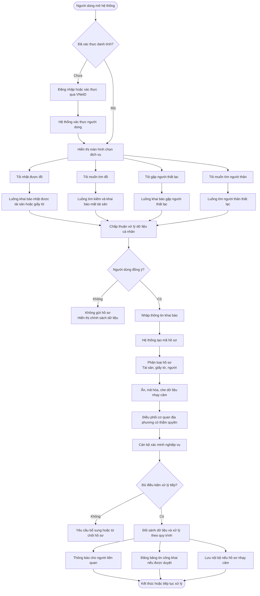

---

# 2. Luồng người nhặt được tài sản / giấy tờ

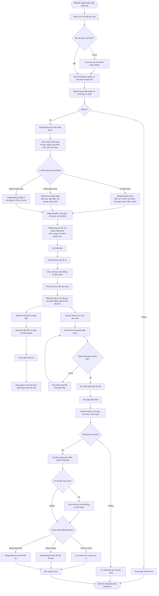

---

# 3. Luồng người muốn tìm tài sản / giấy tờ bị mất

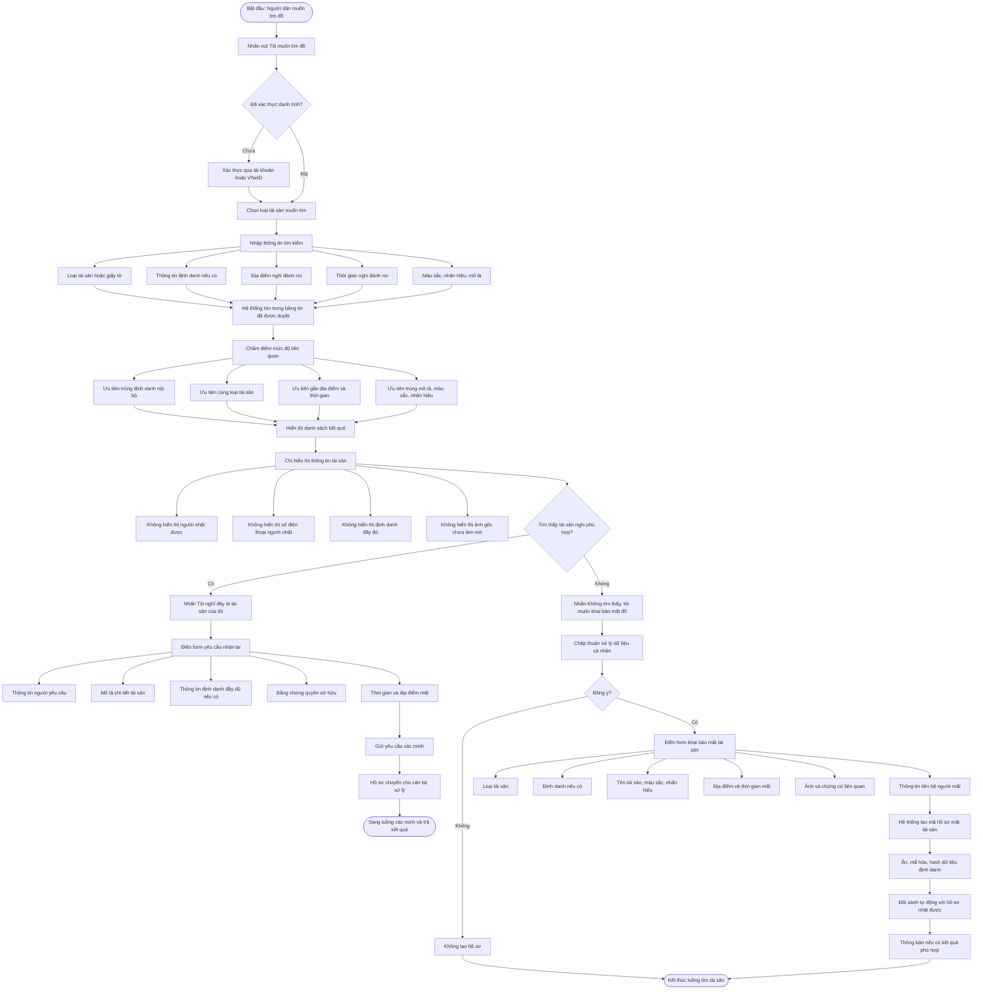

---

# 4. Luồng đối sánh và thông báo tự động

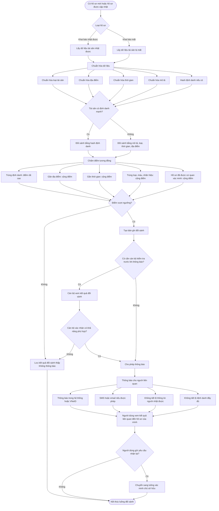

---

# 5. Luồng xác minh nghiệp vụ của cán bộ địa phương

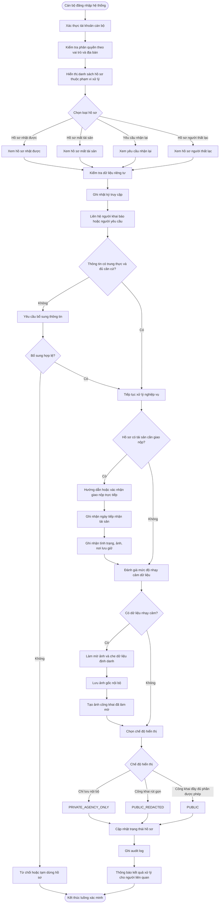

---

# 6. Luồng trả kết quả và bàn giao tài sản

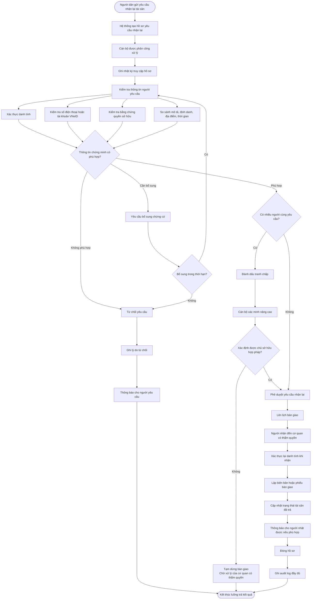

---

# 7. Luồng quản lý thời hạn và xác lập quyền sở hữu

Luồng này dùng cho phần pháp lý về: ghi nhận ngày tiếp nhận, ngày bắt đầu thông báo công khai, tự động tính thời hạn, cảnh báo sắp hết hạn và tạo hồ sơ điện tử để cơ quan có thẩm quyền xem xét xác lập quyền sở hữu. 

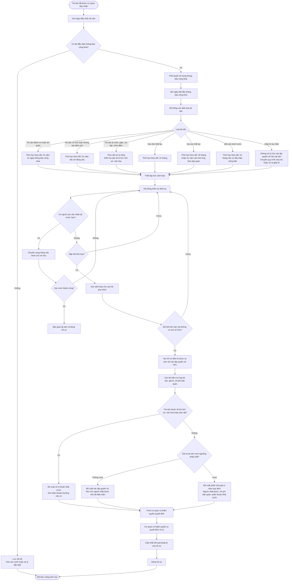

---

# 8. Luồng bảo vệ dữ liệu cá nhân và phân quyền truy cập

Luồng này nên được vẽ riêng vì nó là yêu cầu xuyên suốt. Đánh giá pháp lý nêu rõ người dân chỉ được tra cứu hồ sơ do mình tạo hoặc kết quả đối sánh liên quan tới hồ sơ của mình; công an/UBND cấp xã truy cập theo phạm vi địa bàn và phân quyền; đơn vị vận hành không được khai thác dữ liệu dân cư ngoài phạm vi vận hành kỹ thuật. 

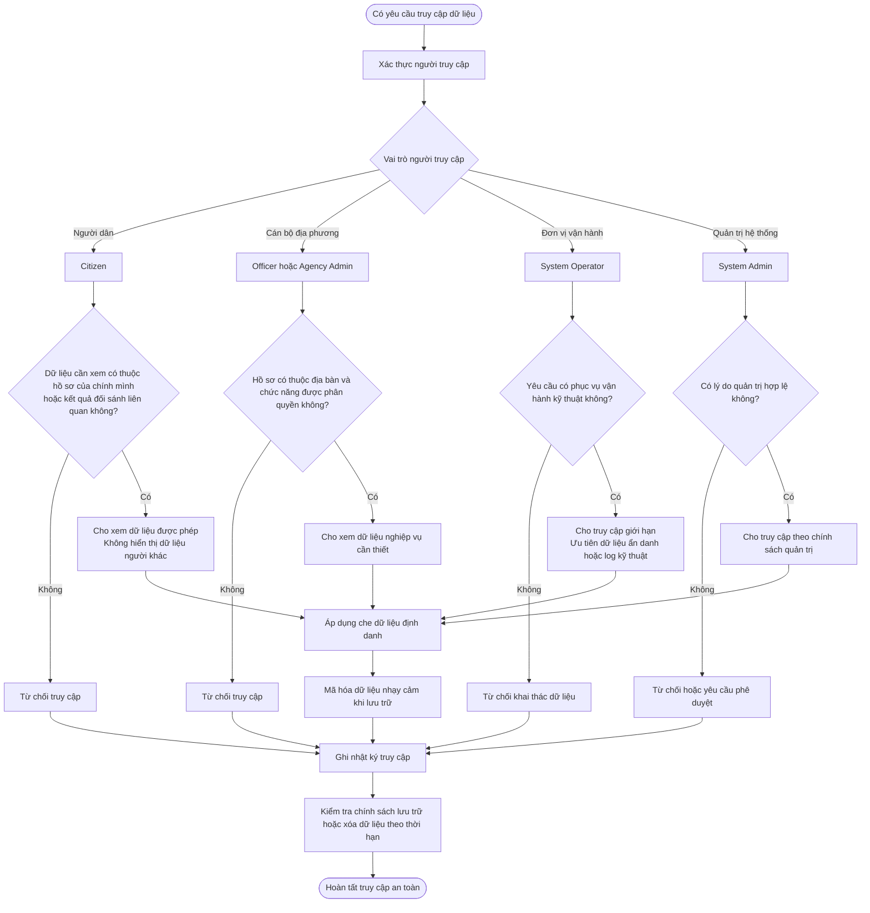

---

# 9. Luồng mở rộng: người dân gặp người thất lạc

Luồng này nên đặt ở giai đoạn sau vì đánh giá pháp lý xác định đây là chức năng nhạy cảm cao, liên quan dữ liệu cá nhân, đặc biệt là trẻ em, người cao tuổi, người mất khả năng nhận thức hoặc người cần hỗ trợ đặc biệt.  

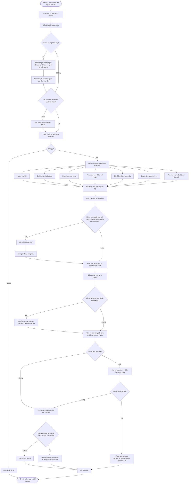

---

# 10. Luồng mở rộng: người dân tìm người thân thất lạc

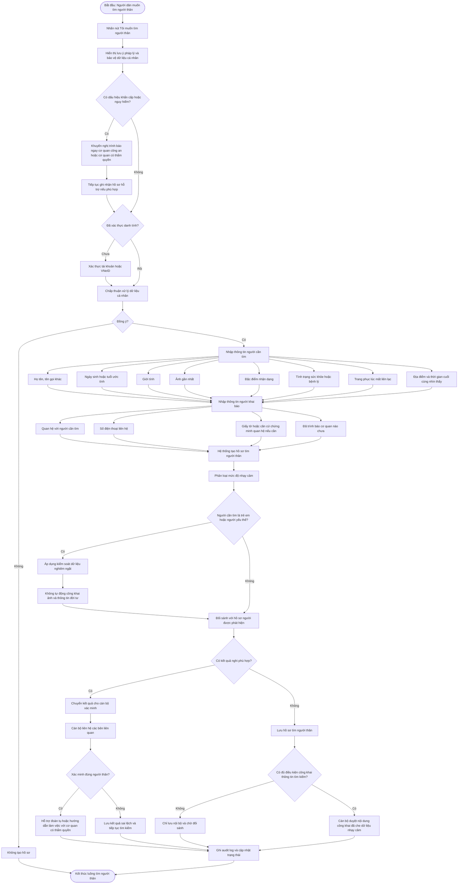

---

# 11. State diagram trạng thái hồ sơ tài sản

Khối này rất hữu ích vì nó mô tả vòng đời hồ sơ.

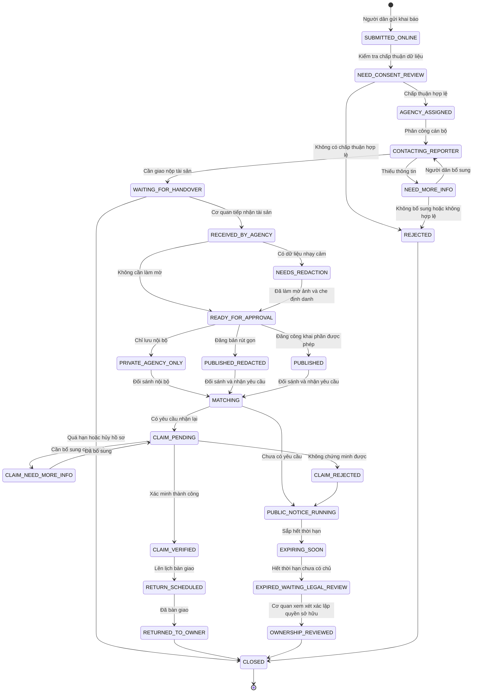

---

# 12. Sơ đồ ERD nghiệp vụ mức cao

Khối này không phải luồng xử lý, nhưng nên có trong draw.io để nhóm dev hiểu dữ liệu chính.

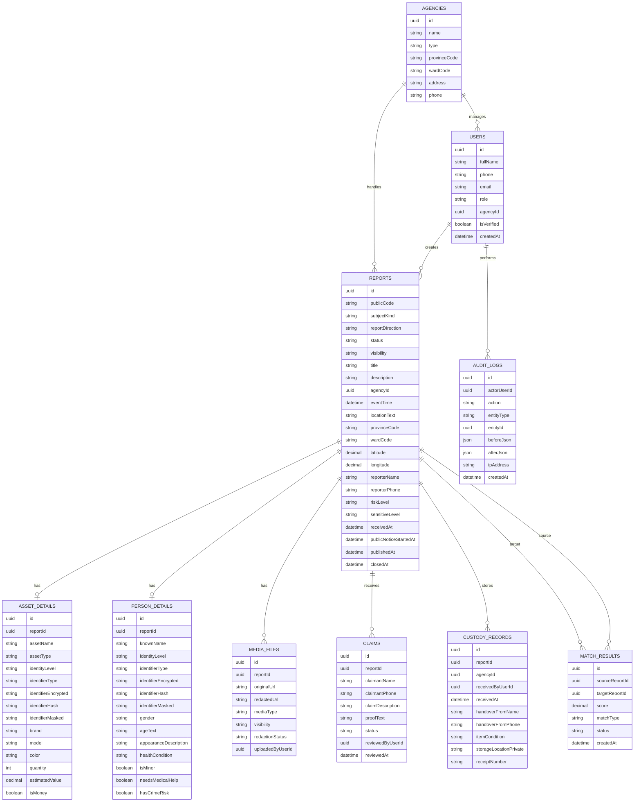

---

Có thể dùng các sơ đồ theo thứ tự sau: **Tổng quan → Nhặt được đồ → Tìm đồ → Đối sánh → Cán bộ xác minh → Trả kết quả → Quản lý thời hạn → Bảo vệ dữ liệu → Người thất lạc → State diagram → ERD**.
